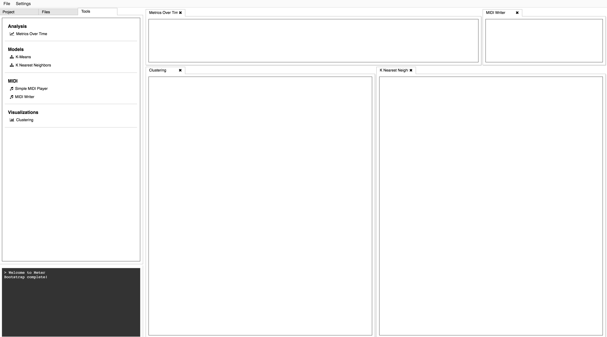

# Meter
A visualization and analysis dashboard intended to aid in the development of machine learning algorithms for Music AI. Weekly progress is being documented on my [Medium blog](https://medium.com/@jeremy.from.earth). 

</img>

## Installation

### Get the source
```
git clone git@github.com:jeremyfromearth/meter.git
```

### Database
Meter uses [MonogDB](https://www.mongodb.com/) for MIDI file meta data storage and search. A store of MIDI files is required to use Meter. There is a huge collection of MIDI files [here on Reddit](https://www.reddit.com/r/WeAreTheMusicMakers/comments/3ajwe4/the_largest_midi_collection_on_the_internet/). There is a script included with Meter that parses MIDI files and saves their meta data to the Mongo database. From the `server` dir:
```
python tasks.py -t midi-to-db -s ./PATH_TO_MIDI_FILE_DIR
```
*Note this script will analyze files recursively. It only processes files in the top level directory*

Once the files have been processed, there is another step which will analyze the unstructured text content of each file and rank terms. 
```
python tasks.py -t midi-to-tfidf -s ./LOCATION_TO_STORE_TERM_MODELS
```
### Client
```
cd meter/client
npm install
npm watch
```
### Server
Meter uses [Conda](https://www.continuum.io/Downloads) to manage the dev environment. With Conda installed:
```
cd meter/server
conda env create -f environment.yml
python run.py
```
